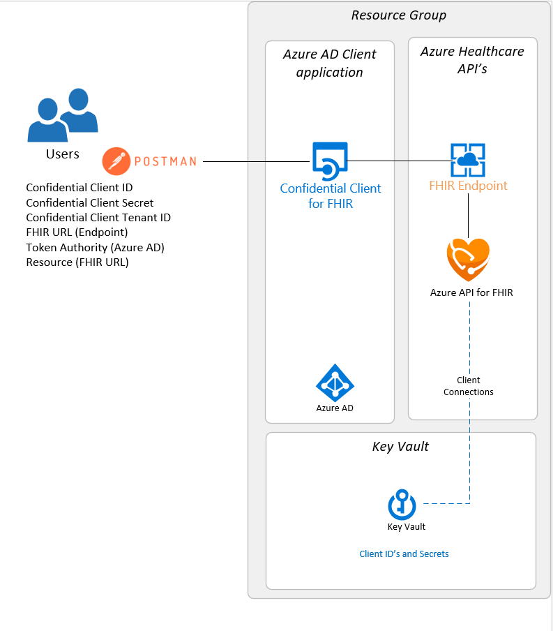

# FHIR-Starter

## Introduction 

The goal of the **FHIR-Starter** is to ease the deployment of an Azure Healthcare API FHIR Service along with a Service Client to get users up and running with FHIR in minutes rather than days.  

Azure API for FHIR is generally available for both public and government in multiple [geo-regions](https://azure.microsoft.com/en-us/global-infrastructure/services/?products=azure-api-for-fhir&regions=non-regional%2Cus-east%2Cus-east-2%2Cus-central%2Cus-north-central%2Cus-south-central%2Cus-west-central%2Cus-west%2Cus-west-2%2Ccanada-east%2Ccanada-central%2Cusgov-non-regional%2Cus-dod-central%2Cus-dod-east%2Cusgov-arizona%2Cusgov-texas%2Cusgov-virginia). For information about government cloud services at Microsoft, check out Azure services by [FedRAMP](https://docs.microsoft.com/en-us/azure/azure-government/compliance/azure-services-in-fedramp-auditscope). 

## FHIR-Starter Details
The FHIR-Starter scripts are designed and tested for the Azure Cloud Shell - Bash Shell environment. The following services will be set up in the **FHIR-Starter** deploy process. Detailed deployment instuctions are located in the [Readme.md](./scripts/Readme.md) within the scripts directory.

1) Azure API for FHIR  
2) Azure Key Vault (users can select to use an existing keyvault as long as they have Purge Secrets access)
3) Azure AD Service Principle for RBAC [link](https://docs.microsoft.com/en-us/cli/azure/create-an-azure-service-principal-azure-cli)
4) Azure Resource Group
5) Postman (for testing)

---

## Deployment Components  

---

## Deployment
To clone a GitHub Repo, you must use a GitHub Account.  Read [Getting Started](https://docs.github.com/en/get-started) for more information.

To deploy resources in Azure, you must have a valid Subscription.  Read [Get or Obtain a valid Azure Subscription](https://azure.microsoft.com/en-us/free/).

__Next Steps__ Complete Setup steps detailed **[here](./scripts/Readme.md)**.

## Tracking Changes & Updates
We continue to monitor questions, feature requests and of course, bugs/issues. You can review the issues list [here](https://github.com/microsoft/fhir-starter/issues).

If you are interested in receiving notifications when we publish updates then please follow this repo. 

## Resources
Below are some references that might be useful for the reader.

* [Azure for the healthcare industry](https://azure.microsoft.com/en-us/industries/healthcare/)
* [Azure API for FHIR](https://azure.microsoft.com/en-us/services/azure-api-for-fhir/)
* [Microsoft Cloud for Healthcare](https://www.microsoft.com/en-us/industry/health/microsoft-cloud-for-healthcare)

## Repository Contents 

The table below lists items contained within this repository:

Directory       | Contains                                                
----------------|--------------------------------------------------
main            | Readme, Security and compliance documents 
docs            | Getting started documents  
scripts         | Readme + Deployment, Setup and Control scripts  
templates       | ARM Templates for customers without Cloud Shell access (__in progress__)

---

## Contributing

This project welcomes contributions and suggestions.  Most contributions require you to agree to a
Contributor License Agreement (CLA) declaring that you have the right to, and actually do, grant us
the rights to use your contribution. For details, visit https://cla.opensource.microsoft.com.

When you submit a pull request, a CLA bot will automatically determine whether you need to provide
a CLA and decorate the PR appropriately (e.g., status check, comment). Simply follow the instructions
provided by the bot. You will only need to do this once across all repos using our CLA.

This project has adopted the [Microsoft Open Source Code of Conduct](https://opensource.microsoft.com/codeofconduct/).
For more information see the [Code of Conduct FAQ](https://opensource.microsoft.com/codeofconduct/faq/) or
contact [opencode@microsoft.com](mailto:opencode@microsoft.com) with any additional questions or comments.

## Trademarks

This project may contain trademarks or logos for projects, products, or services. Authorized use of Microsoft 
trademarks or logos is subject to and must follow 
[Microsoft's Trademark & Brand Guidelines](https://www.microsoft.com/en-us/legal/intellectualproperty/trademarks/usage/general).
Use of Microsoft trademarks or logos in modified versions of this project must not cause confusion or imply Microsoft sponsorship.
Any use of third-party trademarks or logos are subject to those third-party's policies.
