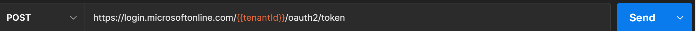

# Instructions 

## Download the Postman files 
You will use the Download feature in Azure Cloud Shell to download* the two **Postman** configuration files needed to get started. These files will download to your local desktop environment.

\*Detailed instructions for using the Upload/Download feature in Azure Cloud Shell can found [here](https://docs.microsoft.com/en-us/azure/cloud-shell/using-the-shell-window#upload-and-download-files).


__Note:__ Each file must be downloaded individually. 

Files to download to your desktop from Azure Cloud Shell:
 - ```/home/$username/fhir-starter/scripts/FHIR-CALLS-Sample-postman-collection.json```
 - ```/home/$username/fhir-starter/scripts/$fhirServiceName.postman_environment.json``` 

(```$fhirServiceName``` is a placeholder for the name given to your Azure API for FHIR deployment)


## Using Postman to connect to Azure API for FHIR

1. [Download and install the Postman app](https://www.postman.com/downloads/) (if you haven't already).

2. Create a new Postman Workspace (or select an existing one if already created).

3. Click the ```Import``` button next to your workspace name. 

4. Import the ```$fhirServiceName.postman_environment.json``` file (see above):
    + Add the file to Postman using the ```Upload Files``` button or paste in the contents of the file using the ```Raw text``` tab
    

5. Import the ```FHIR-CALLS-Sample-postman-collection.json``` file (see above):
    + Add the file to Postman using the ```Upload Files``` button or paste in the contents of the file using the ```Raw text``` tab

6. Select the ```servername``` postman environment in the workspace. (For Example my workspance name is stocore)
   

7. Select the ```AuthorizationGetToken``` call from the ```FHIR Calls-Sample``` collection
   

8. Press __send__ you should receive a valid token it will be automatically set in the bearerToken variable for the environment
   

9. Select the ```List Patients``` call from the ```FHIR Calls-Samples``` collection
   

__NOTE__  For your convenience a Sample Patient file is included in the ```Save Patients``` call.  Simply obtain a Token (see 7 above), and Press send to create a patient. 

10. Press send you should receive and empty bundle of patients from the FHIR Server (unless you created a Patient in Step 9)
   

11. You may now use the token received for the other sample calls or your own calls.  Note: After token expiry (60 min), use the ```AuthorizationGetToken``` call to get another token

