# FHIR-Starter Quickstart   

## Introduction 

The quickstart [Azure Resource Manager](https://docs.microsoft.com/en-us/azure/azure-resource-manager/templates/overview) templates contained in this folder are intended to replicate, where possible, the fhir-starter Bash scripts hosted in this repo. In addition to deploying Azure API for FHIR, these templates also deploy FHIR-Proxy and FHIR-Bulk Loader into your Azure environment.

## Deploy Azure API for FHIR, FHIR-Proxy, and FHIR-Bulk Loader

The Azure Resource Manager / Bicep templates located in this folder will deploy the following services and solutions:
+ Azure API for FHIR
+ FHIR-Proxy
+ FHIR-Bulk Loader

In an effort to simplify the deployment process, [Managed Service Identities](https://docs.microsoft.com/en-us/azure/active-directory/managed-identities-azure-resources/overview) are used wherever possible. These templates currently link to a repo that contains modifications to ensure that the MSIs function as expected. This repo is not in sync with the origin repos. The bicep code or corresponding ARM templates may be modified to update this reference.

There are only a few required parameters: 
+ Subscription
+ [Resource Group](https://docs.microsoft.com/en-us/azure/azure-resource-manager/management/manage-resource-groups-portal)
+ Azure Region
Supported Regions:
    South Africa North,
    South East Asia,
    Australia East,
    Canada Central,
    North Europe,
    West Europe,
    Germany West Central,
    Japan East,
    Switzerland North,
    UK South,
    UK West,
    East US,
    East US 2,
    North Central US,
    South Central US,
    West Central US,
    West US 2
    
+ Deployment Prefix (3-7 characters that will be used as a prefix for all created resources, e.g lrn01)

In order to successfully deploy this ARM template, the user must have the Owner role for the resource group where the template is being deployed and have the ability to create application registrations in Azure Active Directory. 

It is recommended to create a new resource group first and to check to make sure that you have the Owner role for the resource group before running the template. If you have the Owner role for the resource group, then proceed to run the template and deploy into that resource group.

## Step 1 - Initial deployment 

Fill in the parameter values. Click **Review + create** when ready, and then click **Create** on the next page. 

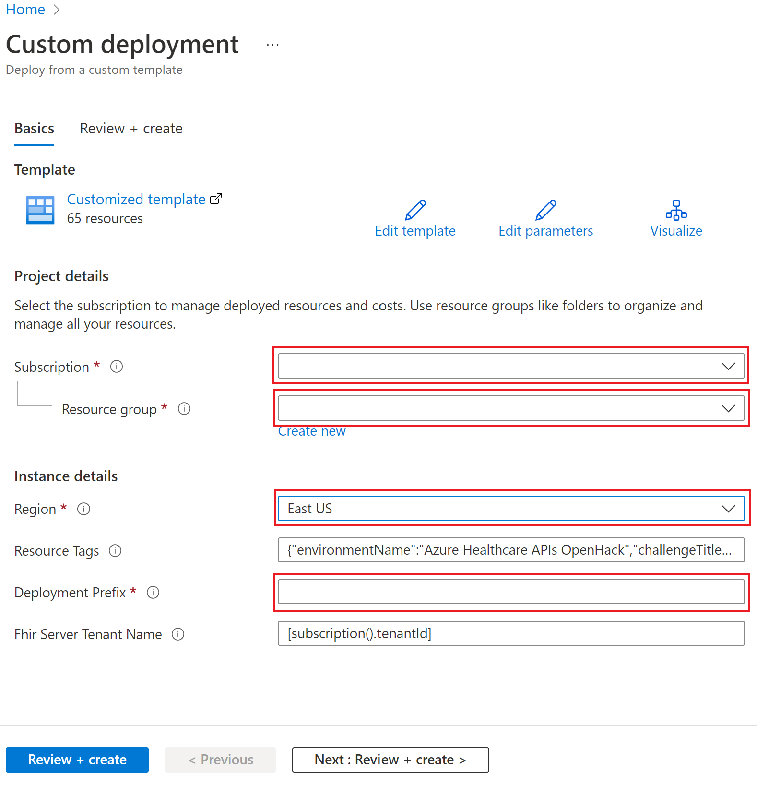 

_Note: Deployment of Azure API for FHIR, FHIR-Proxy, and FHIR-Bulk Loader typically takes around 20 minutes._

## Step 2 - Complete FHIR-Proxy Authentication 
Once the initial deployment has completed, additional steps are necessary to complete the authentication configuration of the FHIR-Proxy function app. 

1. In the Azure Portal, navigate to the FHIR-Proxy function app that was deployed by the resource manager template. 
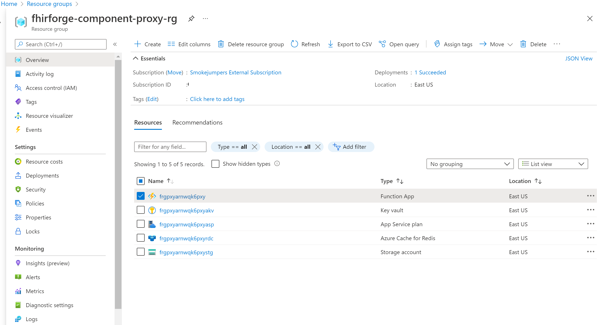

2. Select the function app and select **Authentication**.
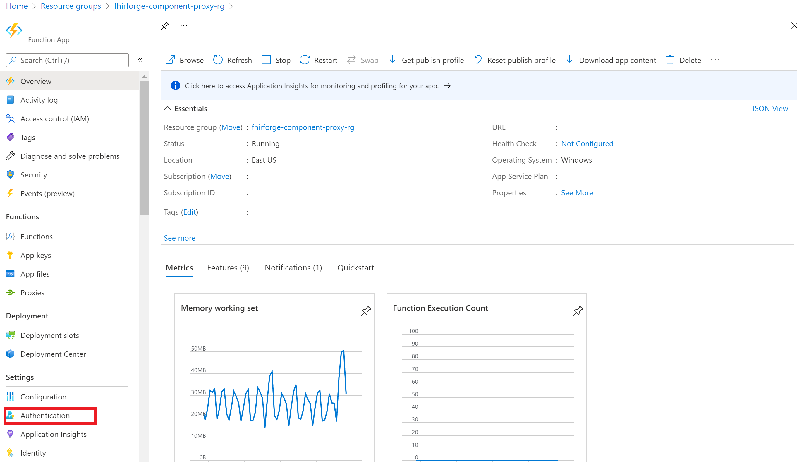

3. Select **Add Identity Provider**.
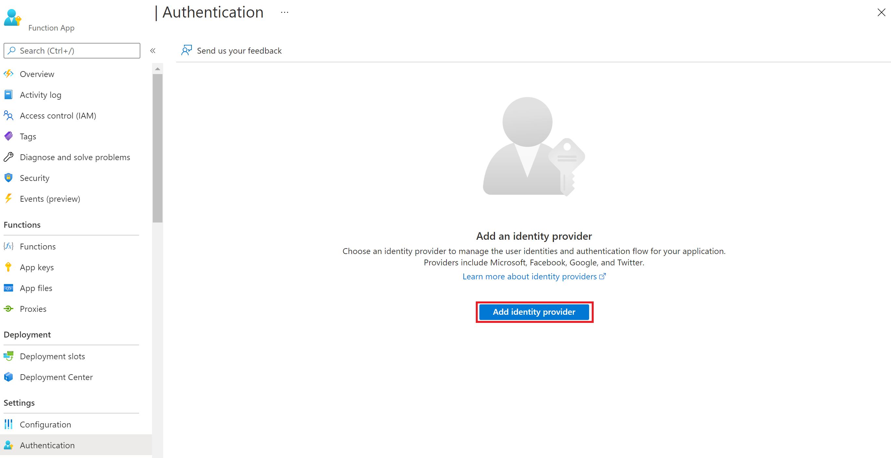

4. Select **Microsoft**.
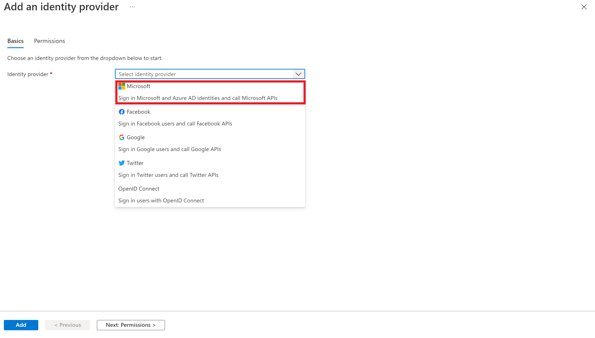

5. Configure basic settings as follows and click **Next Permissions**:
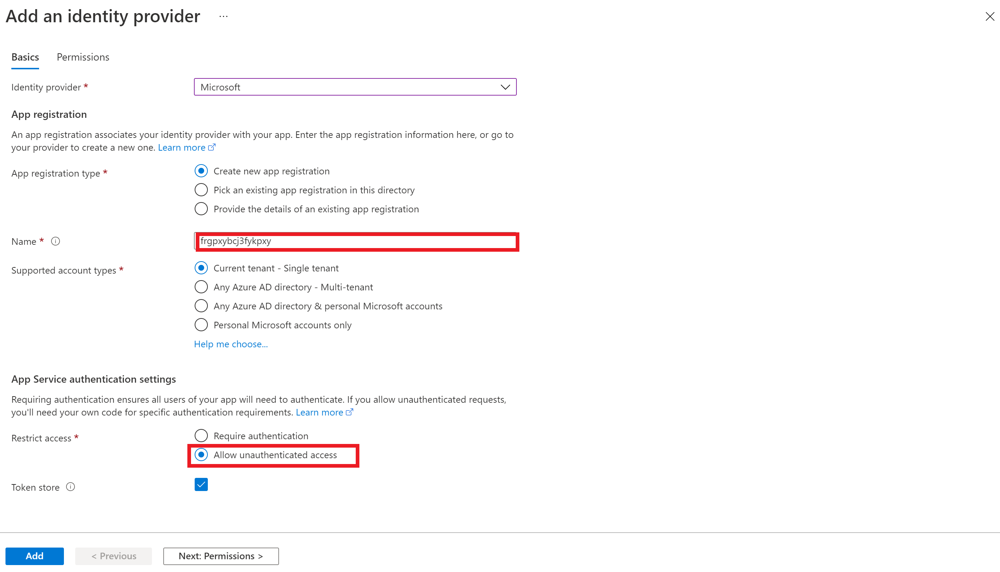

6. Accept the default permissions and click **Add**.
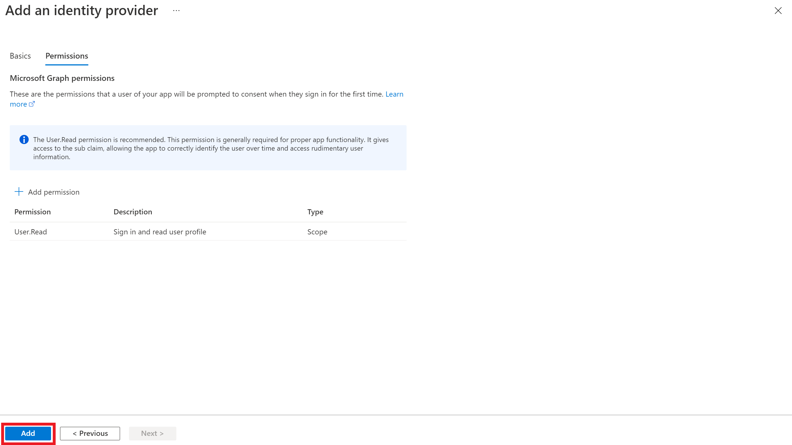

At this point the FHIR-Proxy application registration is complete. 

## Step 3 - Configure App Roles and API Permissions 

Further configuration is required to define **App Roles and Permissions**. Click on the link next to the Microsoft identity provider, which will open the Azure AD blade.
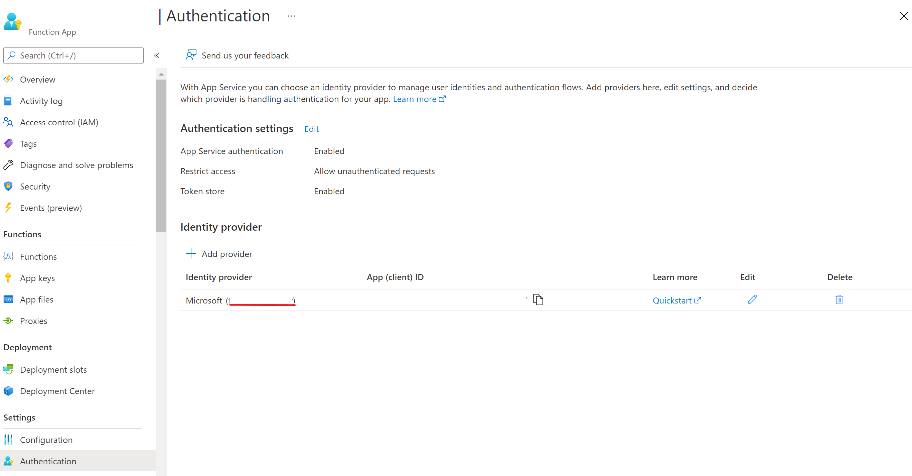

1. Click on **Manifest**.
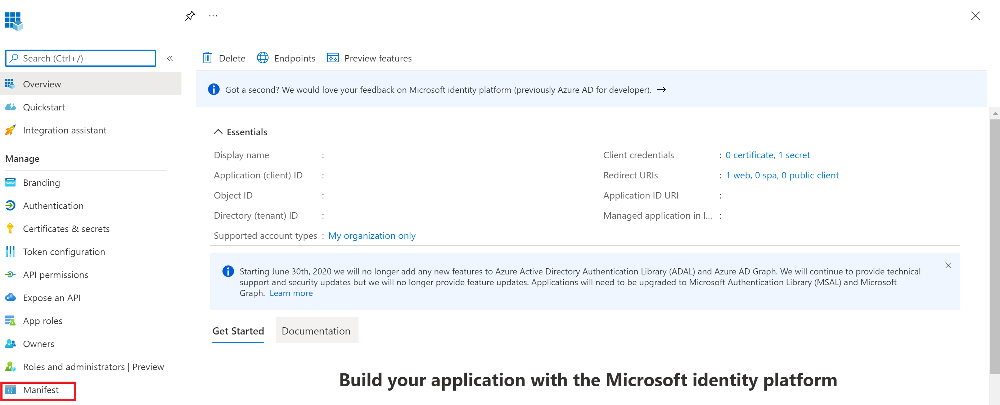

2. Update the **AppRoles** element using the data in the [app roles json](./fhirproxyroles.json) file and click Save.
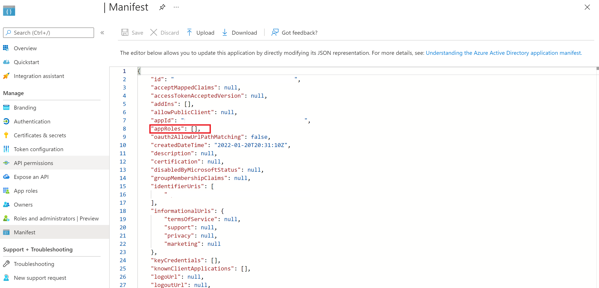

3. The **AppRoles** element should look something like the following:
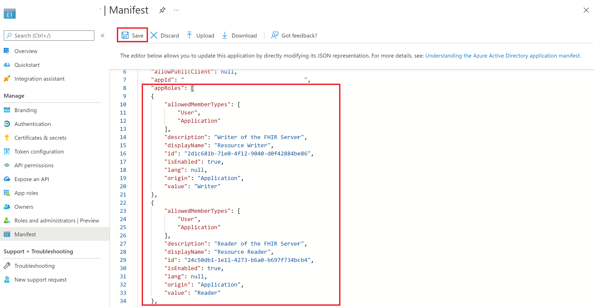

4. Select **API Permissions** and **Add a Permission**.
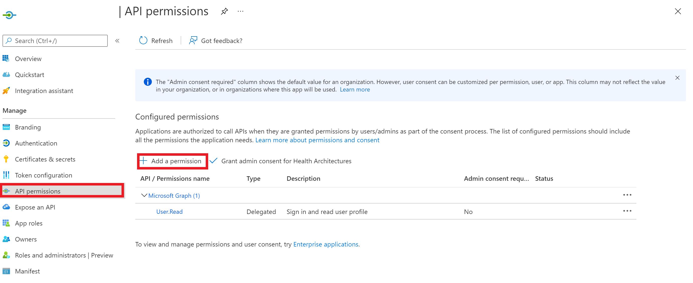

5. Select **APIs my organization uses**.
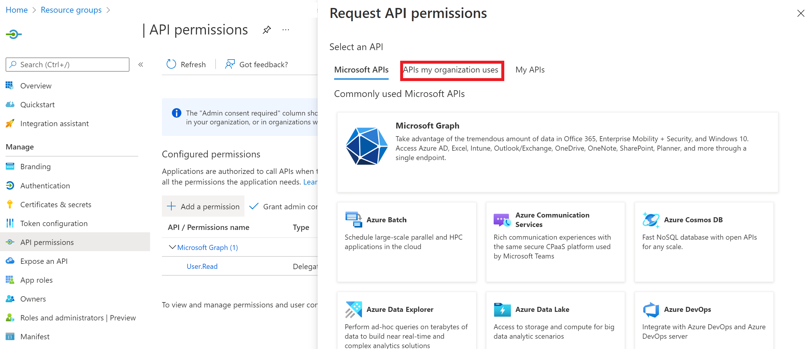

6. Filter the results to **Azure healthcare apis**.
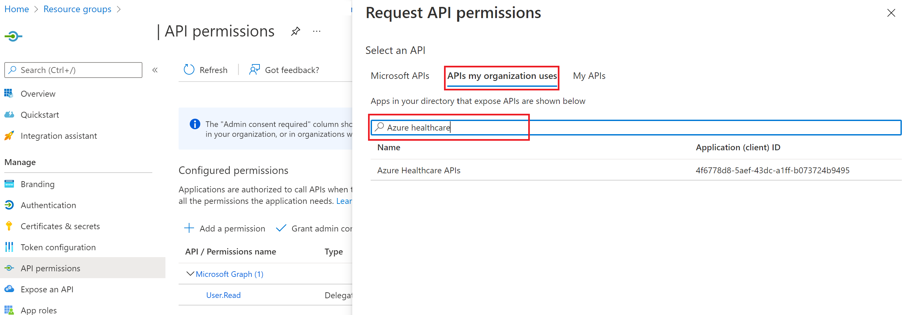

7. Select **Azure healthcare APIs** user_impersonation permission.
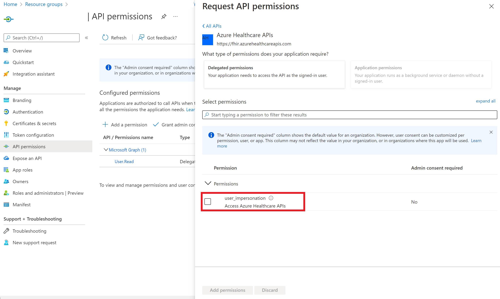

8. Verify the **API Permissions**.
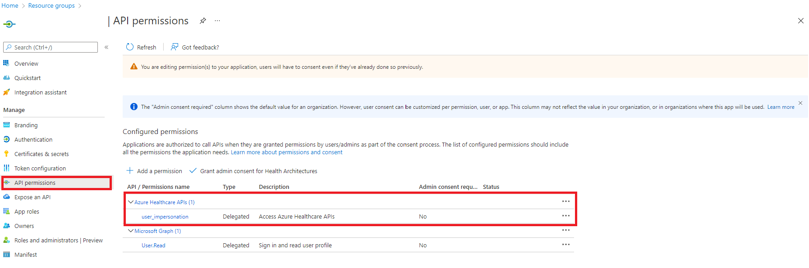

9. Review/verify that the the **App Roles** were created properly.
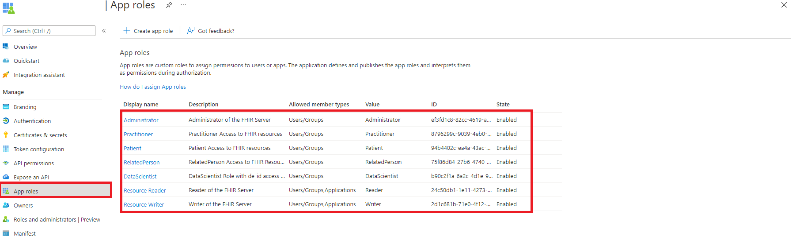
