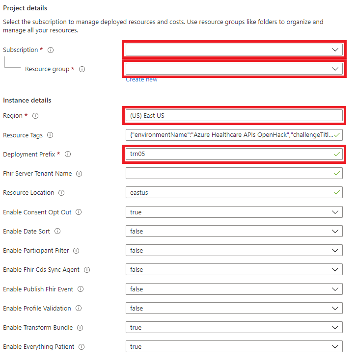

# FHIR-Starter Quickstart   

## Introduction 

The quickstart [Azure Resource Manager](https://docs.microsoft.com/en-us/azure/azure-resource-manager/templates/overview) (ARM) template contained in this folder is intended to replicate, where possible, the `deployFhirStarter.bash` script hosted in [another folder](https://github.com/microsoft/fhir-starter/tree/main/scripts) in this repo (please see the note below about the intended environment for ARM template deployment). Unlike the `deployFhirStarter.bash` script, the quickstart ARM template deploys FHIR-Proxy and FHIR-Bulk Loader in addition to Azure API for FHIR (the `deployFhirStarter.bash` script only deploys Azure API for FHIR). Continue in the next section for instructions on how to deploy Azure API for FHIR, FHIR-Proxy, and FHIR-Bulk Loader with the quickstart ARM template.

__Note:__ This quickstart ARM template is not intended for deployment in a production environment. The intended use for this ARM template is to deploy resources in an Azure [training environment](https://github.com/microsoft/azure-healthcare-apis-workshop). Please proceed accordingly.

## Deploy Azure API for FHIR, FHIR-Proxy, and FHIR-Bulk Loader

To begin, **CTRL+click** (Windows or Linux) or **CMD+click** (Mac) on the **Deploy to Azure** button below to open the deployment form in a new browser tab.

The Azure Resource Manager / Bicep template located in this folder will deploy the following components:
+ [Azure API for FHIR](https://docs.microsoft.com/en-us/azure/healthcare-apis/azure-api-for-fhir/overview)
+ [FHIR-Proxy](https://github.com/microsoft/fhir-proxy)
+ [FHIR-Bulk Loader](https://github.com/microsoft/fhir-loader)

In an effort to simplify the deployment process, [Managed Service Identities](https://docs.microsoft.com/en-us/azure/active-directory/managed-identities-azure-resources/overview) are used wherever possible. This template currently links to a repo that contains modifications to ensure that the MSIs function as expected. This repo is not in sync with the origin repos. The bicep code or corresponding ARM template may be modified to update this reference.

There are only a few required parameters for deployment: 
+ Subscription
+ [Resource Group](https://docs.microsoft.com/en-us/azure/azure-resource-manager/management/manage-resource-groups-portal)
+ Azure Region (Supported Regions: 
    South Africa North, 
    South East Asia, 
    Australia East, 
    Canada Central, 
    North Europe, 
    West Europe, 
    Germany West Central, 
    Japan East, 
    Switzerland North, 
    UK South, 
    UK West, 
    East US, 
    East US 2, 
    North Central US, 
    South Central US, 
    West Central US, 
    West US 2) 
    
+ Deployment Prefix (3-7 characters that will be used as a prefix for all created resources - e.g., "lrn01")

__Important:__ In order to successfully deploy this ARM template, the user must have the Owner role for the resource group where the components are being deployed and have the ability to create [application registrations](https://docs.microsoft.com/en-us/azure/active-directory/roles/permissions-reference#application-administrator) in Azure Active Directory. 

__Note:__ It is recommended to create a new resource group first and check to make sure that you have the Owner role (for that resource group) before running the template. If you have the Owner role, then proceed to run the template and deploy into that resource group.

## Step 1 - Initial deployment 

Fill in the parameter values. Click **Review + create** when ready, and then click **Create** on the next page. 

 

_Note: Deployment of Azure API for FHIR, FHIR-Proxy, and FHIR-Bulk Loader with the ARM template typically takes around 20 minutes._

## Step 2 - Complete FHIR-Proxy Authentication 
Once the initial deployment has completed, additional steps are necessary to complete the authentication configuration of the FHIR-Proxy function app. 

1. In the Azure Portal, navigate to the FHIR-Proxy function app that was deployed by the resource manager template. 

2. Select the function app and select **Authentication**.

3. Click **Add identity provider**.

4. Select **Microsoft**.

5. Configure basic settings as follows and click **Next Permissions**.

6. Click **Add**.

At this point, the FHIR-Proxy application registration is complete. 

## Step 3 - Configure App Roles and API Permissions 

Further configuration is required to define **App Roles and Permissions**. 

1. Click on the link next to the Microsoft identity provider, which will open the Azure AD blade.

2. Click on **Manifest**.

3. Update the **appRoles** element using the data in the [app roles json](./fhirproxyroles.json) file.

4. The **appRoles** element should look something like shown below. Click **Save**.

5. Select **API permissions** and **Add a Permission**.

6. Select **APIs my organization uses**.

7. Filter the results to "Azure Healthcare APIs". Click on **Azure Healthcare APIs**.

8. Select the **user_impersonation permission** box and click **Add permissions**.

9. Verify the **API permissions**.

10. Verify that the **App roles** were created properly.

