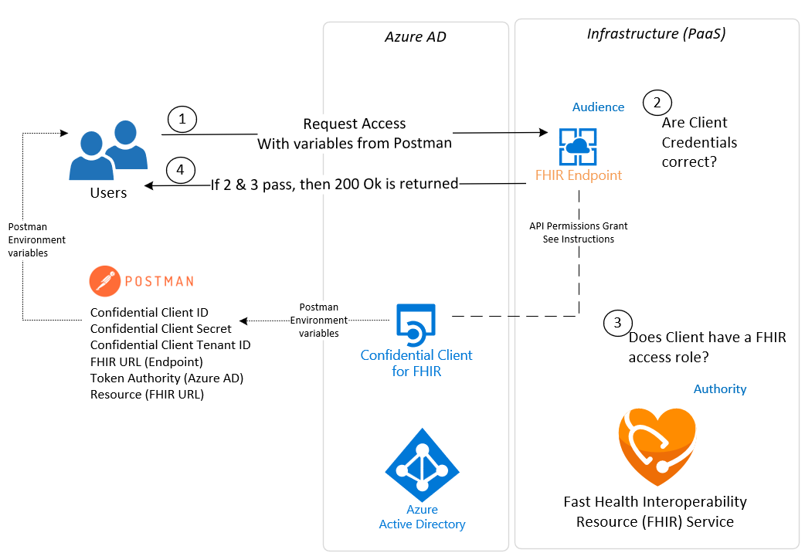

# FHIR-Starter Deploy Script Getting Started
In this document, we go over the ```deployFhirStarter.bash``` script for deploying [Azure API for FHIR](https://docs.microsoft.com/en-us/azure/healthcare-apis/azure-api-for-fhir/overview). We cover script execution and the steps needed to get up and running.

## Errata 
There are no open issues at this time. 

## Prerequisites 

The ```deployFhirStarter.bash``` script will gather (and export) information necessary for the proper deployment and configuration of **Azure API for FHIR** and associated Azure Resources. Please make sure to have the following in place before going forward with the deploy process.

 - User must have rights to deploy Azure Resources at the Subscription scope (i.e., [Contributor](https://docs.microsoft.com/en-us/azure/role-based-access-control/built-in-roles) role).

__Note:__
This script will prompt the user with the option to create a new [Resource Group](https://docs.microsoft.com/en-us/azure/azure-resource-manager/management/manage-resource-groups-portal#:~:text=A%20resource%20group%20is%20a,to%20manage%20as%20a%20group.) for Azure API for FHIR, and within the Resource Group, the user will have the option to deploy a new [Key Vault](https://docs.microsoft.com/en-us/azure/key-vault/general/basic-concepts#:~:text=Azure%20Key%20Vault%20is%20a,security%20module(HSM)%20pools.). Alternatively, the script gives the user the option to input the name of an existing Resource Group, and the script also leaves the option to use an existing Key Vault instead of creating a new one. In either case (new or existing), the script needs to establish a Key Vault for securing [Service Client Credentials](https://docs.microsoft.com/en-us/azure/active-directory/fundamentals/service-accounts-principal) used with [Azure API for FHIR](https://docs.microsoft.com/en-us/azure/healthcare-apis/azure-api-for-fhir/overview) and [FHIR-Proxy](https://github.com/microsoft/fhir-proxy). If you opt to use an existing Resource Group and Key Vault, it is important that only one Key Vault be in the Resource Group where Azure API for FHIR is deployed. If multiple Key Vaults are in the Azure API for FHIR Resource Group, problems can arise later when deploying FHIR-Proxy and other Azure Resources. If necessary, please use the [backup and restore](https://docs.microsoft.com/en-us/azure/key-vault/general/backup?tabs=azure-cli) option to copy credentials for central storage in one Key Vault.

__Note:__ 
The ```deployFhirStarter.bash``` script is designed and tested for the [Azure Cloud Shell - Bash Shell](https://docs.microsoft.com/en-us/azure/cloud-shell/features#:~:text=Azure%20Cloud%20Shell%20is%20a,and%20maintaining%20a%20machine%20yourself.) environment.


### Naming & Tagging
All Azure resource types have a scope in which resource names must be unique. Some resource names, such as PaaS services with public endpoints, have global scopes. Therefore, their names must be unique across the entire Azure platform. Our deployment scripts suggest resource names in alignment with Azure best practices. Users are prompted to accept a default (automatically generated) resource name, or they have the option to supply their own custom resource name during installation. See below for an example of the default **Azure API for FHIR** resource naming convention used by the ```deployFhirStarter.bash``` script. Note that while the default Environment label is ```dev``` (for deploying in a development environment), the script also gives the option to select ```qa``` (for a quality assurance/test environment), or ```prod``` (for a production environment).

Resource Type | Deploy App Name | Environment | Number      | Resource Name Example (automatically generated)
--------------|-----------------|-------------|-------------|------------------------------------------------
api          | fhir           | dev        | random      | api-fhir-dev-12345

Azure Resources deployed with the ```deployFhirStarter.bash``` script are automatically tagged with their origin and deployment name (see example below). Users are able to add/change [Tags](https://docs.microsoft.com/en-us/azure/azure-resource-manager/management/tag-resources?tabs=json) after installation.

Origin                 |  Deployment       
-----------------------|-----------------
HealthArchitectures | FHIRStarter   

---

## Getting Started

Launch Azure Cloud Shell (Bash Environment)  

**CTRL+click** (Windows or Linux) or **CMD+click** (Mac) to open in a new tab  
  
[](https://shell.azure.com/bash?target="_blank")

Clone this repo in your Azure Cloud Shell environment 
```azurecli-interactive
git clone https://github.com/microsoft/fhir-starter.git 
```
Change the working directory in your Azure Cloud Shell environment to the ```./fhir-starter/scripts``` directory.
```azurecli-interactive
cd $HOME/fhir-starter/scripts
```

Make the Bash script inside the ```./fhir-starter/scripts``` directory executable.
```azurecli-interactive
chmod +x *.bash 
```

## Step 1.  deployFhirStarter.bash
The ```deployFhirStarter.bash``` script is the main deployment script for **Azure API for FHIR** and associated components.    

Ensure you are in the proper directory 
```azurecli-interactive
cd $HOME/fhir-starter/scripts
``` 

Launch the ```deployFhirStarter.bash``` shell script inside the ```fhir-starter/scripts``` directory
```azurecli-interactive
./deployFhirStarter.bash 
``` 

Alternatively, the ```deployFhirStarter.bash``` script can launch with command line options. You can pre-specify the ```<value>``` for any of the supported parameters (see below).
```azurecli
./deployFhirStarter.bash -i <subscriptionId> -g <resourceGroupName> -l <resourceGroupLocation> -k <keyVaultName> -n <fhirServiceName> -p <yes -or - no for postman setup>
```

Azure Components installed 
 - Resource Group (if needed)
 - Azure API for FHIR 
 - Key Vault (customers can choose to use an existing Keyvault as long as they have Purge Secrets access)
 - Azure AD Application Service Principal for RBAC

Information needed by this script 
 - FHIR Service Name
 - KeyVault Name 
 - Resource Group Location 
 - Resource Group Name 

__FHIR-Starter__ Key Vault values saved by this script 

Name              | Value                                | Use             
------------------|--------------------------------------|---------------------------------
FS-TENANT-NAME    | Azure AD Tenant GUID                 | Tenant where Client applications can obtain a Token 
FS-CLIENT-ID      | Service Client Application ID        | Client Application ID used for Token Access  
FS-CLIENT-SECRET  | Service Client Application Secret    | Client Application Secret used for Token Access                    
FS-SECRET         | Service Client Application Secret    | Saved for backwards compatibility  
FS-RESOURCE       | Application Endpoint for Auth Access | Endpoint for Authority (AD) Token grant  
FS-URL            | Application Endpoint for Clients     | Endpoint for FHIR Service interaction 


## Step 2.  Setup Postman
Once the script finishes deployment, users can use Postman to test access to the new FHIR Service.  Instructions on setting up Postman can be found in the docs directory [here](../docs/postman.md).

### Auth Layout


